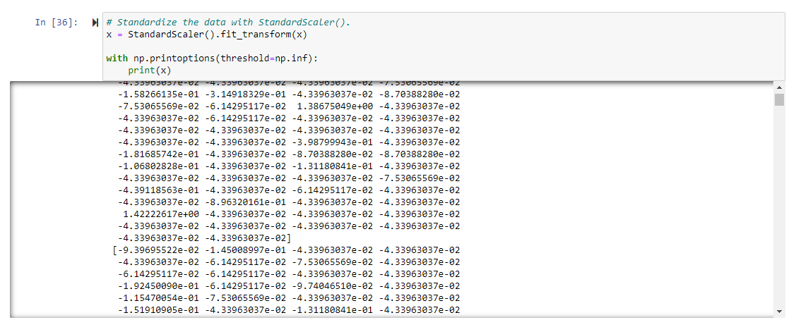

<<<<<<< HEAD
# Cryptocurrencies

## Overview of Challenge
This challenge made it a point to use various unsupervised machine learning modules on cryptocurrency data and be efficient while using it. 

## Models
* Standard Scaler

*  PCA 

* K Means with an Elbow Curve 

* 3D Plot to View Data 

* HV Plot 

